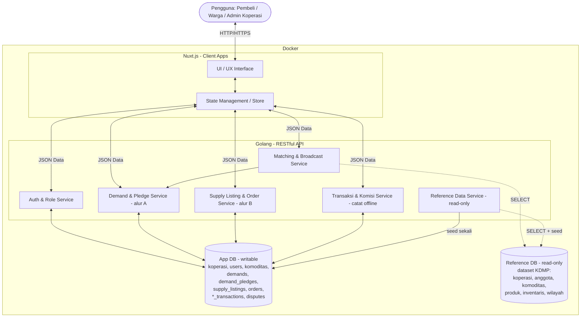
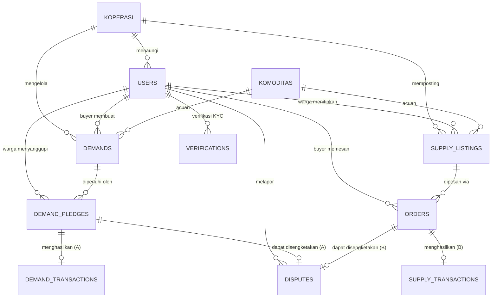

# PRD — Project Requirements Document

## 1. Overview

**Masalah yang Diselesaikan**  
Saat ini, terjadi ketidakcocokan antara pasokan desa dan permintaan pasar riil. Di satu sisi, produsen (seperti peternak atau petani) berproduksi secara "buta" tanpa kepastian pembeli, menanggung risiko kerugian besar; hasil panen yang sudah ada pun sering tidak terserap. Di sisi lain, pembeli (seperti pemilik usaha kuliner) kesulitan mendapatkan pasokan bahan baku yang konsisten dalam harga maupun kualitas. Di tengah mereka, rantai tengkulak mengambil porsi keuntungan yang besar, sementara koperasi desa hanya berperan sebagai penampung pasif.

**Tujuan Aplikasi**  
Budes adalah platform yang menempatkan **Koperasi Desa (KDMP) sebagai hub/perantara digital** antara warga dan pasar. Di atas peran itu berjalan **dua alur** yang saling melengkapi:

* **Alur A — Pra-pesan / Demand (marketplace terbalik):** pembeli mengumumkan kebutuhan, koperasi menyebarkannya ke warga, dan **produsen desa menyanggupi** (penuh atau sebagian, gotong royong). Cocok untuk produksi berbasis pesanan pasti.
* **Alur B — Titip-jual / Supply:** warga menitipkan komoditas yang **sudah ada** ke koperasi, koperasi mempostingnya sebagai **listing**, dan pembeli tinggal **memesan**. Cocok untuk hasil panen siap jual.

Transaksi terjadi **nyata di lapangan** (tunai/transfer antara pembeli, koperasi, dan warga). Peran sistem adalah **mencatat & merapikan** transaksi tersebut beserta **komisi koperasi**, bukan menahan dana. Dengan ini, produksi desa berjalan berdasarkan permintaan, panen siap mendapat jalur pasar, pembeli mendapat pasokan terjamin, dan koperasi memperoleh penghasilan dari biaya layanan.

**Landasan Data (Grounded pada Dataset KDMP)**  
Berbeda dari marketplace yang mengarang katalog, sisi-suplai Budes **ditanamkan pada dataset resmi Koperasi Desa Merah Putih (KDMP/KDKMP)** yang disediakan panitia hackathon (DB `hackathon_2026`): **1.026 koperasi desa riil, 74.269 anggota/warga, 8.191 potensi komoditas unggulan desa** (komoditas teratas: Padi, Jagung, Ayam, Sapi, Perikanan, Cabai, Kambing, Pisang), **~13.974 produk & inventaris gerai**, 1.942 gerai, beserta hierarki wilayah provinsi→kab/kota→kecamatan→desa. Data koperasi, komoditas, dan warga di aplikasi **di-seed dari dataset ini dan tetap tertaut** ke sumber resminya (`koperasi_ref`, `komoditas_ref`, `anggota_ref`) sehingga bisa ditelusuri balik. Konsekuensinya: **arsitektur dua-database** (lihat §5) — App DB writable untuk transaksi Budes + Reference DB read-only sebagai cermin KDMP untuk seed & lookup.

## 2. Requirements

*   **Fokus pada Niat Pengguna Dulu (Try-before-Register):** Pengunjung harus dapat melihat daftar kebutuhan (alur A) dan listing komoditas (alur B) secara transparan sebelum diwajibkan mendaftar. Pendaftaran baru diminta ketika mereka melakukan aksi konkret ("Sanggupi", "Pasang Kebutuhan", "Pesan", atau "Titipkan").
*   **Dua Alur Transaksi:** Sistem mendukung **Demand** (pembeli minta → warga sanggupi → setor ke koperasi → serah ke pembeli) dan **Supply** (warga titip → koperasi listing → pembeli pesan). Keduanya diperantarai koperasi.
*   **Pemenuhan Fleksibel (Gotong Royong):** Pada alur Demand, satu permintaan besar (misal: 500 ekor ayam) harus bisa disanggupi banyak warga bersama-sama sesuai kapasitas masing-masing (misal: 5 orang @100 ayam).
*   **Transaksi Offline yang Tercatat (tanpa escrow penuh):** Pembayaran terjadi di luar sistem (tunai/transfer). Sistem **mencatat** tiap transaksi — nilai kotor, komisi koperasi, nilai bersih ke warga — dengan status pembayaran `UNPAID → PAID → SETTLED`. Tidak ada dompet digital atau rekening bersama; model ini menyesuaikan realitas transaksi desa yang mayoritas tunai.
*   **Uang Muka (DP) Pra-pesan:** Untuk alur Demand, pembeli membayar **uang muka** (default **30%**) sebagai komitmen sebelum kebutuhan disebar. DP dibayar & dicatat offline (`dp_status` `UNPAID → PAID`); sisa (`remaining_amount`) dibayar saat serah-terima. Bila pembeli batal, DP **`FORFEITED`** (hangus, jadi kompensasi); bila demand gagal/dibatalkan koperasi, DP **`REFUNDED`**. Ini memberi keseriusan pra-pesan tanpa menahan seluruh dana.
*   **Verifikasi Identitas (KYC):** BUYER & WARGA dapat mengajukan verifikasi identitas (NIK + foto KTP + dokumen pendukung opsional). **ADMIN_KOPERASI** meninjau (`VERIFIED`/`REJECTED`). Status `verification_status` menjadi penanda kepercayaan (mis. syarat untuk aksi bernilai besar).
*   **Sistem Komisi Koperasi:** Sistem menghitung otomatis komisi sekian persen untuk koperasi dari setiap transaksi, tercatat rapi di pembukuan koperasi.
*   **Penyelesaian Sengketa Sebagian:** Jika dalam pesanan gotong royong ada satu warga yang gagal setor/kirim, hanya bagian (pledge/order) milik warga tersebut yang masuk sengketa; bagian warga lain yang berhasil tetap diproses.
*   **Grounded pada Data Nyata (Dataset KDMP):** Koperasi, komoditas unggulan, dan warga di-seed dari dataset KDMP read-only dan menyimpan referensi balik (`koperasi_ref`/`komoditas_ref`/`anggota_ref`). Matching/broadcast kebutuhan memakai sinyal komoditas & inventaris nyata per wilayah.

## 3. Core Features

Berdasarkan model hub-koperasi dua-alur, pilar utama platform ini meliputi:

*   **Akun & Profil** [medium] — Identitas pengguna.
    *   *Daftar Akun*: pendaftaran untuk 3 peran: **BUYER** (pembeli, bisa dari luar desa), **WARGA** (produsen anggota koperasi), **ADMIN_KOPERASI** (pengurus).
    *   *Tautkan Identitas KDMP*: warga/admin dapat menaut ke koperasi (`koperasi_ref`) & identitas anggota (`anggota_ref`) nyata dari dataset KDMP.
    *   *Login & Logout*: autentikasi JWT standar.
    *   *Verifikasi Identitas (KYC)*: pengguna mengajukan `VERIFICATIONS` (NIK, foto KTP, dokumen pendukung); ADMIN_KOPERASI meninjau → `verification_status` pengguna `UNVERIFIED → PENDING → VERIFIED/REJECTED`.
    *   *Riwayatku*: audit semua aktivitas pasang/sanggup/titip/pesan + rekap transaksi & komisi.

*   **Alur A — Pasang Kebutuhan (Demand)** [high] — permintaan dari pembeli.
    *   *Buat Postingan Baru*: form pembeli menulis komoditas (acuan ke `KOMODITAS`), jumlah, satuan, target harga/item, tenggat. Sistem menghitung `total_price`, `dp_amount` (default 30%), dan `remaining_amount`.
    *   *Bayar Uang Muka (DP)*: demand mulai `DRAFT`; setelah DP tercatat `PAID`, berpindah `OPEN` dan disebar ke warga. DP bisa `FORFEITED` (pembeli batal) / `REFUNDED` (demand gagal).
    *   *Jelajah Pasar*: etalase publik semua permintaan aktif + progress % tersanggupi.
    *   *Penyanggupan (Pledge)*: warga menekan "Sanggupi" dan mengisi jumlah yang sanggup dipenuhi (mendukung gotong royong).
    *   *Setor ke Koperasi*: warga menyetor barang ke koperasi (`DELIVERED_TO_KOPERASI`), lalu koperasi menyerahkan ke pembeli (`HANDED_TO_BUYER`).

*   **Alur B — Titip-Jual (Supply)** [high] — komoditas warga yang sudah ada.
    *   *Titipkan Komoditas*: warga/koperasi membuat `SUPPLY_LISTING` (komoditas, jumlah tersedia, harga/item).
    *   *Etalase Listing*: pembeli menelusuri listing aktif (publik).
    *   *Pesan (Order)*: pembeli membuat `ORDER` (jumlah, snapshot harga) → `CONFIRMED` → `HANDED_OVER`.

*   **Konfirmasi Serah-Terima** [high] — penyelesaian dua arah.
    *   *Daftar Serah-Terima*: barang yang sudah disetor/dipesan menunggu konfirmasi fisik.
    *   *Verifikasi Penerimaan*: pembeli menandai barang diterima (penuh/sebagian).
    *   *Lapor Masalah*: opsi mengangkat sengketa bila barang rusak/tak sesuai/belum tiba.

*   **Pencatatan Transaksi & Komisi** [high] — pembukuan koperasi.
    *   *Catat Transaksi Offline*: tiap pledge (alur A) atau order (alur B) menghasilkan catatan `DEMAND_TRANSACTIONS`/`SUPPLY_TRANSACTIONS` (gross, koperasi_fee, net, metode CASH/TRANSFER, status UNPAID/PAID/SETTLED).
    *   *Rekap Komisi*: total komisi koperasi per periode masuk pembukuan.
    *   *Dashboard Koperasi*: pantau semua transaksi kedua alur.

*   **Matching & Broadcast Grounded (data KDMP)** [high] — diferensiator.
    *   *Kandidat pemenuh*: saat kebutuhan (Demand) dibuat, sistem menyarankan desa/koperasi yang **berpotensi memenuhi** dari sinyal komoditas unggulan (`referensi_komoditas_desa`) & stok gerai (`inventaris_produk`) nyata per wilayah.
    *   *Broadcast tertarget*: notifikasi diarahkan ke warga/koperasi relevan, bukan broadcast buta.

*   **Sistem Notifikasi** [medium] — real-time.
    *   *Broadcast Kebutuhan*, *Update Status* (disanggupi/dipesan/diserahkan/dibayar), *Peringatan Tenggat*.

## 4. User Flow

**Eksplorasi Awal (semua pengguna).** Pengunjung membuka web dan langsung melihat "Jelajah Pasar" (kebutuhan aktif — alur A) dan etalase listing komoditas (alur B), tanpa login.

**Alur A — Pra-pesan (Demand):**
1.  Pembeli klik "Buat Postingan Baru", memilih komoditas + jumlah + target harga + tenggat (diminta Login/Daftar bila belum). Demand tersimpan `DRAFT`; sistem menghitung `total_price` & `dp_amount` (30%).
2.  Pembeli membayar **uang muka** (offline, tunai/transfer); koperasi mencatat `dp_status = PAID`. Demand berpindah `OPEN` dan tampil publik (berstempel "DP Terbayar").
3.  Koperasi/sistem menyebarkan ke warga relevan (matching grounded). Warga menekan "Sanggupi" (misal "sanggup 100 ekor"); banyak warga bisa mengisi bersama sampai kebutuhan terpenuhi.
4.  Warga menyiapkan & menyetor barang ke koperasi sebelum tenggat (status `DELIVERED_TO_KOPERASI`). Koperasi menyerahkan ke pembeli (`HANDED_TO_BUYER`).
5.  Pembeli melunasi `remaining_amount` & mengonfirmasi penerimaan. Sistem mencatat `DEMAND_TRANSACTIONS` per warga: gross dibayar pembeli, dipotong komisi koperasi, sisanya net ke warga — status pembayaran diperbarui (`PAID`/`SETTLED`). Bila pembeli batal → DP `FORFEITED`; bila bermasalah → `DISPUTES` (hanya bagian terkait).

**Alur B — Titip-jual (Supply):**
1.  Warga menitipkan komoditas yang sudah ada; koperasi memposting `SUPPLY_LISTING` (jumlah tersedia + harga).
2.  Pembeli menelusuri etalase, membuat `ORDER` (jumlah, snapshot harga) → koperasi `CONFIRMED`.
3.  Serah-terima di koperasi/gerai (`HANDED_OVER`); pembeli konfirmasi.
4.  Sistem mencatat `SUPPLY_TRANSACTIONS` (gross, komisi, net) + status pembayaran. Sengketa bila perlu.

## 5. Architecture

Platform ini memadukan frontend web reaktif (Nuxt.js) dengan API backend (Go) yang dikemas dalam kontainer Docker untuk kemudahan deployment.

**Arsitektur Dua-Database.** Dataset KDMP hackathon bersifat read-only (`SELECT` saja), sehingga Budes memisahkan penyimpanan menjadi dua Postgres:

*   **App DB (writable)** — database milik Budes dengan **skema mandiri**: `koperasi`, `users`, `komoditas`, `demands`, `demand_pledges`, `supply_listings`, `orders`, `demand_transactions`, `supply_transactions`, `disputes`. Inilah satu-satunya sumber tulis.
*   **Reference DB (read-only)** — cermin lokal dataset KDMP (27 tabel). Dipakai untuk **(a) seed awal** tabel `koperasi`/`komoditas`/warga di App DB, dan **(b) lookup live** saat registrasi/penautan identitas & matching. Backend mengaksesnya lewat *connection pool khusus SELECT* (Reference Data Service).

Tabel App DB menyimpan kolom telusur `*_ref` (mis. `koperasi_ref`, `komoditas_ref`, `anggota_ref`) sebagai **soft reference** ke KDMP — bukan FK lintas-database, hanya penanda asal-usul data untuk kredibilitas & audit.

> **Catatan model:** Tidak ada escrow/dompet. Pembayaran offline; `*_transactions` hanya **mencatat** nilai kotor, komisi koperasi, nilai bersih, metode, dan status pembayaran.

## 6. Database Schema

Skema berikut adalah **App DB (writable)** milik Budes — model hub-koperasi dua-alur, transaksi offline. Semua PK `UUID`. Kolom `*_ref`/`*_sample_id` adalah **soft reference** telusur ke Reference DB KDMP (§6b): disimpan sebagai nilai biasa (bukan FK lintas-DB). Kolom audit `user_input`, `tanggal_input`, `user_update`, `tanggal_update` ada di tabel transaksional (diringkas di ERD).

*   **koperasi**: Koperasi Desa (hub). Seed dari KDMP `profil_koperasi` × `referensi_koperasi_wilayah` × `referensi_wilayah`.
    *   `id` (UUID) PK · `nama` · `desa` · `wilayah` · `kontak` · `status` (tinyint: 1=aktif, 9=hapus)
    *   `koperasi_ref` (Text) — *soft ref* → KDMP `referensi_koperasi_wilayah.koperasi_ref`
*   **users**: Pengguna 3 peran. Warga di-seed/ditaut dari KDMP `anggota_koperasi`.
    *   `id` (UUID) PK · `koperasi_id` (FK, null bila buyer eksternal) · `name` · `phone` · `email` · `password_hash` · `role` (Enum `BUYER`,`WARGA`,`ADMIN_KOPERASI`) · `status`
    *   `verification_status` (Enum `UNVERIFIED`,`PENDING`,`VERIFIED`,`REJECTED`) · `verified_at` (Timestamp, nullable)
    *   `anggota_ref` (Text, nullable) — *soft ref* → KDMP `anggota_koperasi.anggota_ref`
*   **verifications**: Pengajuan verifikasi identitas (KYC).
    *   `id` (UUID) PK · `user_id` (FK, pengaju) · `nik` · `id_card_file` (foto KTP) · `support_doc_file` (opsional) · `status` (Enum `PENDING`,`VERIFIED`,`REJECTED`) · `reviewed_by` (FK → users ADMIN_KOPERASI) · `review_note` · `reviewed_at`
*   **komoditas**: Master komoditas. Seed dari KDMP `referensi_komoditas_desa`.
    *   `id` (UUID) PK · `nama` · `kategori` · `satuan` (kg, ikat, karung, dll)
    *   `komoditas_ref` (Text, nullable) — *soft ref* → KDMP `referensi_komoditas_desa.komoditas_ref`
*   **demands** (Alur A — kebutuhan pembeli):
    *   `id` PK · `buyer_id` FK · `koperasi_id` FK · `komoditas_id` FK · `item_name` · `satuan` · `total_qty` · `fulfilled_qty` · `target_price_per_item` · `deadline` · `demand_status` (Enum `DRAFT`,`OPEN`,`PARTIAL`,`CLOSED`,`EXPIRED`)
    *   **Uang muka (DP):** `total_price` · `dp_percent` (default 30) · `dp_amount` · `remaining_amount` · `dp_payment_method` (Enum `CASH`,`TRANSFER`) · `dp_status` (Enum `UNPAID`,`PAID`,`FORFEITED`,`REFUNDED`) · `dp_paid_at`
*   **demand_pledges** (Alur A — sanggupan warga):
    *   `id` PK · `demand_id` FK · `warga_id` FK · `qty_pledged` · `qty_delivered` · `price_per_item` (harga sepakat) · `pledge_status` (Enum `PENDING`,`ACCEPTED`,`DELIVERED_TO_KOPERASI`,`HANDED_TO_BUYER`,`CANCELLED`)
*   **supply_listings** (Alur B — titipan warga):
    *   `id` PK · `koperasi_id` FK · `warga_id` FK · `komoditas_id` FK · `item_name` · `satuan` · `qty_available` · `qty_sold` · `price_per_item` · `listing_status` (Enum `DRAFT`,`POSTED`,`SOLD_OUT`,`CLOSED`)
*   **orders** (Alur B — pesanan pembeli):
    *   `id` PK · `listing_id` FK · `buyer_id` FK · `qty_ordered` · `price_per_item` (snapshot) · `total_amount` · `order_status` (Enum `PENDING`,`CONFIRMED`,`HANDED_OVER`,`CANCELLED`)
*   **demand_transactions** / **supply_transactions** (catatan transaksi offline per alur):
    *   `id` PK · (`demand_pledge_id` | `order_id`) FK · `gross_amount` (dibayar buyer) · `koperasi_fee` · `net_amount` (diterima warga) · `payment_method` (Enum `CASH`,`TRANSFER`) · `payment_status` (Enum `UNPAID`,`PAID`,`SETTLED`) · `paid_at`
*   **disputes** (sengketa lintas alur):
    *   `id` PK · `demand_pledge_id` FK (alur A) · `order_id` FK (alur B) · `source_type` (Enum `DEMAND`,`SUPPLY`) · `reported_by` FK · `reason` · `dispute_status` (Enum `OPEN`,`REVIEW`,`RESOLVED`) · `resolution` · `resolved_at`

> ERD lengkap: `erd_marketplace_koperasi.mermaid`.

## 6b. Reference Database (read-only — dataset KDMP) & Seed Mapping

Database referensi = **cermin lokal 27 tabel dataset hackathon** (`hackathon_2026`, di-clone ke Postgres Docker lokal; hanya `SELECT`). Dipakai untuk **seed** App DB + **lookup** live. Pemetaan seed:

| Tabel App DB | Di-seed / ditaut dari KDMP | Kolom kunci KDMP |
|---|---|---|
| `koperasi` | `profil_koperasi` × `referensi_koperasi_wilayah` × `referensi_wilayah` (1.026) | `koperasi_ref`, `nama_koperasi`, `kode_wilayah`, `provinsi`, `kab_kota`, `kecamatan`, `desa_kelurahan` |
| `users` (WARGA) | `anggota_koperasi` (74.269) | `anggota_ref`, `koperasi_ref`, `nama` |
| `komoditas` | `referensi_komoditas_desa` (8.191) | `komoditas_ref`, `nama_komoditas`, `kode_wilayah`, `volume`, `nilai_potensi_desa` |
| *(matching)* stok gerai | `produk_koperasi` + `inventaris_produk` (13.974) | `produk_sample_id`, `koperasi_ref`, `nama_produk`, `stok` |
| *(distribusi)* titik gerai | `gerai_koperasi` + `referensi_gerai_koperasi` (1.942) | `gerai_ref`, `koperasi_ref` |

**Aturan integritas soft-ref:** karena tidak ada FK lintas-database, Reference Data Service memvalidasi keberadaan nilai `*_ref` saat penautan/seed (mis. cek `koperasi_ref` benar-benar ada). Nilai yang sudah di-*resolve* boleh di-cache.

**Catatan kualitas data:** kolom `satuan`/`unit` di KDMP bervariasi (mis. "Gal", "LITER", "50 Kg", "Ikat") dan sebagian `volume`/`nilai_potensi_desa` berskala ekstrem — perlu normalisasi ringan saat seed & matching.

## 7. Tech Stack

*   **Frontend**: Nuxt.js (Vue 3) + Tailwind CSS / Nuxt UI — responsif, mulus, *SEO-friendly* untuk halaman publik (try-before-register). State via Pinia.
*   **Backend**: Go (Golang) — REST API cepat untuk logika dua-alur, pencatatan transaksi + komisi, dan matching grounded; JWT auth; WebSocket untuk update status real-time.
*   **Database**: PostgreSQL — dijalankan **dua instance** (§5): **App DB** (writable, transaksional) dan **Reference DB** (read-only, cermin dataset KDMP). Backend Go memakai dua connection pool terpisah; pool Reference dibatasi `SELECT`. (Tanpa escrow/dompet — transaksi dicatat, bukan ditahan.)
*   **Deployment**: Docker + Docker Compose (Nuxt, Go, App DB, Reference DB). Reference DB di-*seed* dari dump dataset KDMP saat provisioning; App DB diisi lewat migrasi + seed turunan KDMP.
