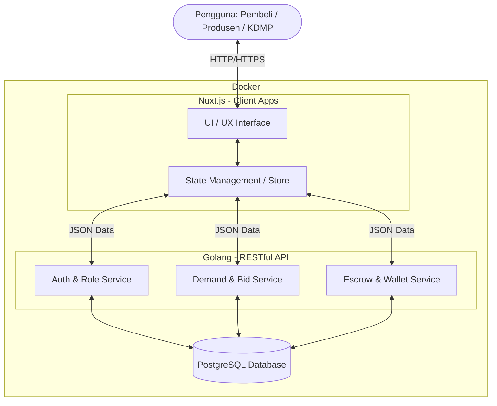
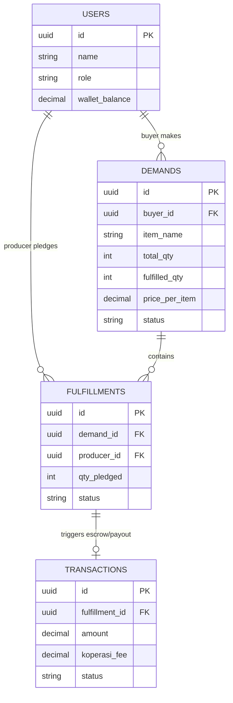

# PRD — Project Requirements Document

## 1. Overview

**Masalah yang Diselesaikan**  
Saat ini, terjadi ketidakcocokan antara pasokan desa dan permintaan pasar riil. Di satu sisi, produsen (seperti peternak atau petani) berproduksi secara "buta" tanpa kepastian pembeli, menanggung risiko kerugian besar. Di sisi lain, pembeli (seperti pemilik usaha kuliner) kesulitan mendapatkan pasokan bahan baku yang konsisten dalam harga maupun kualitas. Di tengah mereka, rantai tengkulak mengambil porsi keuntungan yang besar.

**Tujuan Aplikasi**  
Aplikasi ini adalah sebuah platform "marketplace terbalik" khusus ekosistem desa. Sistem membalikkan alur tradisional: **pembeli yang mengumumkan kebutuhan, dan produsen desa yang menyanggupi**. Aplikasi ini bertujuan mempertemukan produsen dan pembeli secara langsung "tanpa cari-cari". Koperasi Desa (KDMP) hadir sebagai infrastruktur dan penjamin lewat sistem pembayaran *escrow* (rekening bersama). Dengan ini, produksi desa berjalan berdasarkan pesanan pasti, pembeli mendapat pasokan terjamin, dan koperasi mendapatkan penghasilan dari biaya layanan (komisi).

## 2. Requirements

*   **Fokus pada Niat Pengguna Dulu (Try-before-Register):** Pengunjung harus dapat melihat daftar kebutuhan (permintaan pembeli) secara transparan sebelum diwajibkan mendaftar. Pendaftaran baru diminta ketika mereka melakukan aksi konkret (seperti menekan tombol "Sanggupi" atau "Pasang Kebutuhan").
*   **Pemenuhan Fleksibel (Gotong Royong):** Satu permintaan besar dari pembeli (misal: 500 ekor ayam) harus bisa disanggupi oleh banyak produsen kecil secara bersama-sama sesuai kapasitas masing-masing (misal: 5 orang masing-masing menyanggupi 100 ayam).
*   **Keamanan Finansial (Escrow Sederhana):** Dana pembeli ditahan oleh sistem terlebih dahulu. Pencairan ke produsen hanya terjadi *setelah* pembeli mengonfirmasi barang diterima dengan baik.
*   **Sistem Komisi Koperasi:** Sistem harus secara otomatis memotong komisi sekian persen untuk koperasi dari setiap transaksi yang berhasil diselesaikan, yang tercatat rapi di pembukuan.
*   **Penyelesaian Sengketa Sebagian:** Jika dalam pesanan gotong royong ada satu produsen yang gagal kirim, hanya dana milik produsen tersebut yang ditahan/dikembalikan, sedangkan produsen yang berhasil tetap dibayar.

## 3. Core Features

Berdasarkan kerangka fitur (Roadmap) Fase 1, pilar utama platform ini meliputi:

*   **Pasang Kebutuhan** [high] — Permintaan kebutuhan dari pihak pembeli.
    *   *Buat Postingan Baru*: Form bagi pembeli menulis spesifikasi barang, jumlah, dan tenggat waktu.
    *   *Jelajah Pasar*: Etalase yang menampilkan semua permintaan aktif dari pembeli, dapat dilihat publik (sebelum login).
    *   *Lihat Detail Permintaan*: Halaman lengkap yang menunjukkan progres berapa persen kebutuhan yang sudah disanggupi dan siapa saja yang menyanggupi.
*   **Sanggupi Pesanan** [high] — Respon dari produsen desa.
    *   *Ajukan Sanggupan*: Tombol untuk warga mendaftar/memasukkan jumlah barang yang sanggup mereka penuhi dari sebuah permintaan.
    *   *Pantau Sanggupanku*: Dashboard ringkas untuk warga memantau daftar sanggupan mereka dan status operasionalnya.
*   **Konfirmasi Terima** [high] — Penyelesaian logistik dan garansi.
    *   *Daftar Kiriman*: Daftar barang yang telah dikirim oleh produsen namun menunggu pengecekan fisik oleh pembeli.
    *   *Verifikasi Penerimaan*: Tombol konfirmasi 2 arah; pembeli menandai barang diterima (keseluruhan/sebagian).
    *   *Lapor Masalah*: Opsi menahan transaksi jika barang rusak, tidak sesuai, atau belum tiba.
*   **Escrow Dana** [high] — Pengelolaan arus uang yang aman.
    *   *Lihat Status Dana*: Visualisasi jernih apakah dana di tahap Ditahan (Tahap Proses), Dicairkan (Selesai), atau Disengketakan (Masalah).
    *   *Pencairan Otomatis*: Sistem transfer/pemindahan saldo mutlak kepada produsen *real-time* usai pembeli klik verifikasi terima.
    *   *Dompet & Komisi*: Saldo digital warga dan kalkulasi pemotongan admin secara otomatis untuk dimasukkan ke pembukuan koperasi per transaksi.
*   **Akun & Profil** [medium] — Identitas pengguna aplikasi.
    *   *Daftar Akun*: Modul pendaftaran untuk 3 peran utama: Pembeli, Produsen, dan Pengurus Koperasi.
    *   *Login & Logout*: Tata cara autentikasi aman standar ekosistem.
    *   *Lihat Riwayatku*: Catatan (audit trail) semua tindakan pasang, sanggup, rekap komisi, dan dana mutasi.

*   **Sistem Notifikasi** [medium] — Pengingat real-time untuk kelancaran transaksi.
    *   *Broadcast Kebutuhan*: Notifikasi ke semua produsen desa saat ada pembeli memposting kebutuhan baru.
    *   *Update Status Pesanan*: Notifikasi otomatis saat barang telah disanggupi, dikirim, atau dana telah cair ke dompet.
    *   *Peringatan Tenggat*: Pengingat otomatis bagi produsen 24 jam sebelum batas waktu pengiriman berakhir.

## 4. User Flow

Berikut adalah perjalanan langkah demi langkah para pengguna dari masuk ke web hingga transaksi berhasil:

1.  **Eksplorasi Awal (Semua Pengguna)**
    *   Pengunjung membuka web dan langsung melihat halaman "Jelajah Pasar".
    *   Pengunjung melihat daftar "Dibutuhkan: 500 Ayam, 50kg Cabai, dll".
2.  **Flow Pembeli (Membuat Kepastian)**
    *   Pembeli klik "Buat Postingan Baru" terkait kebutuhannya.
    *   Sistem meminta pembeli untuk Login/Daftar & melakukan deposit/transfer dana pesanan total ke sistem (Escrow).
    *   Sistem menahan dana; Permintaan tampil secara publik dengan stempel "Dana Terjamin".
3.  **Flow Produsen Desa (Menangkap Permintaan)**
    *   Petani/peternak melihat permintaan di Jelajah Pasar, lalu menekan "Ajukan Sanggupan" (misal: "Saya sanggup 100 ekor").
    *   Diminta Login/Daftar jika belum.
    *   Menyiapkan dan mengirim barang sebelum tenggat waktu tiba. Melalui aplikasi, status diubah menjadi "Dikirim".
4.  **Flow Serah Terima & Pencairan**
    *   Pembeli menerima barang secara fisik.
    *   Pembeli buka aplikasi, masuk ke "Daftar Kiriman", lalu klik "Verifikasi Penerimaan" khusus untuk 100 ekor dari/petani tersebut.
    *   *Trigger Sistem:* Dana 100 ekor otomatis cair (dikurangi komisi KDMP) menuju "Dompet" produsen.
    *   Petani bisa menarik uang ke rekening pribadi.

## 5. Architecture

Platform ini dibangun menggunakan arsitektur modern perpaduan sistem berbasis modul web frontend yang reaktif berkomunikasi dengan API backend (microservices-oriented), yang dirangkum menjadi satu kontainer untuk memudahkan deployment ke cloud. 

## 6. Database Schema

Berikut adalah ringkasan entitas tabel untuk mendukung marketplace gotong-royong dan sistem escrow.

*   **users**: Menyimpan data seluruh pengguna (Buyer, Producer, Koperasi).
    *   `id` (UUID) - Primary Key
    *   `name` (String) - Nama pengguna
    *   `role` (Enum) - `BUYER`, `PRODUCER`, `KOPERASI`
    *   `wallet_balance` (Decimal) - Saldo internal pengguna
*   **demands**: (Kebutuhan / Permintaan Pembeli)
    *   `id` (UUID) - Primary Key
    *   `buyer_id` (UUID) - Relasi ke `users`
    *   `item_name` (String) - Contoh: "Ayam Potong"
    *   `total_qty` (Int) - Jumlah total yg diminta (misal: 500)
    *   `fulfilled_qty` (Int) - Jumlah yg sudah disanggupi (misal: 100)
    *   `price_per_item` (Decimal) - Harga penawaran per item
    *   `status` (Enum) - `OPEN`, `PARTIAL`, `CLOSED`
*   **fulfillments**: (Sanggupan / Komitmen Produsen)
    *   `id` (UUID) - Primary Key
    *   `demand_id` (UUID) - Relasi ke `demands`
    *   `producer_id` (UUID) - Relasi ke `users`
    *   `qty_pledged` (Int) - Jumlah yg disanggupi
    *   `status` (Enum) - `PENDING`, `SHIPPED`, `RECEIVED`, `DISPUTED`
*   **transactions**: (Sistem pembukuan dana Escrow & Komisi)
    *   `id` (UUID) - Primary Key
    *   `fulfillment_id` (UUID) - Relasi ke `fulfillments`
    *   `amount` (Decimal) - Total dana yg ditahan
    *   `koperasi_fee` (Decimal) - Potongan untuk koperasi
    *   `status` (Enum) - `ON_HOLD`, `RELEASED`, `REFUNDED`

## 7. Tech Stack

Untuk menjamin performa tinggi, keamanan berstandar enterprise, dan kemudahan _maintenance_ (sesuai input prioritas), berikut rekomendasi teknologi:

*   **Frontend**: Nuxt.js (Framework Vue.js) dipadukan dengan Tailwind CSS (atau pustaka UI sepert Nuxt UI) untuk membuat tampilan yang super responsif, mulus, dan *SEO-friendly* bahkan sebelum pengguna login.
*   **Backend**: Go (Golang) — Bahasa pemograman yang sangat cepat (*high performance*), sangat cocok untuk mengeksekusi logika *escrow* berlapis, sistem komisi transaksi, dan API ringan antar pengguna di *real-time*.
*   **Database**: PostgreSQL — Relational database yang kokoh (ACID Compliance) sangat mutlak diperlukan ketika sedang menangani masalah dompet digital, escrow, dan saldo para pengguna.
*   **Deployment**: Docker — Membungkus seluruh aplikasi (Nuxt, Go, dan PostgreSQL) dalam *container*, sehingga saat dieksekusi di *server* manapun (VPS seperti DigitalOcean atau AWS), sistem dapat berjalan konsisten tanpa khawatir masalah konfigurasi lingkungan.