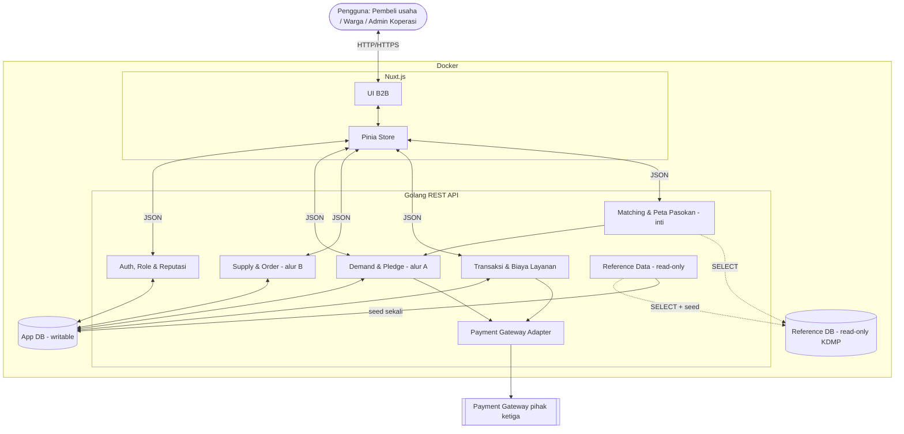
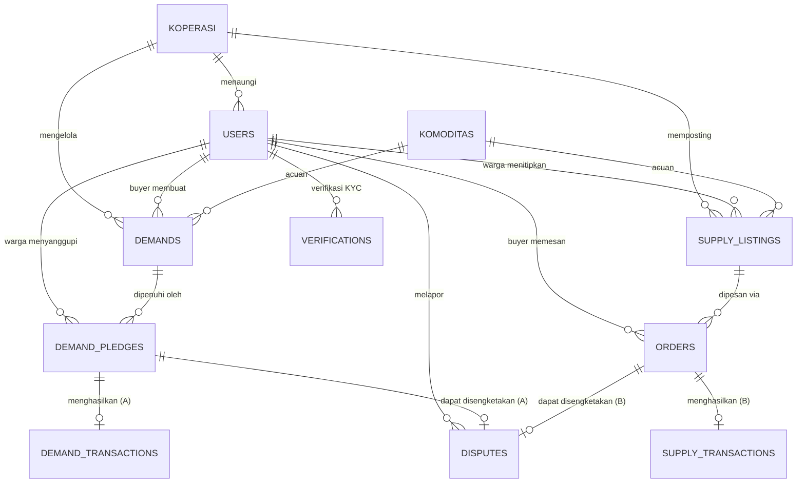

# PRD — Product Requirements Document

## 1. Overview

**Masalah yang diselesaikan.**
Terjadi ketidakcocokan antara pasokan desa dan permintaan pasar riil. Produsen (petani/peternak) berproduksi "buta" tanpa kepastian pembeli; hasil panen sering tidak terserap. Pembeli usaha (kuliner/katering) kesulitan pasokan konsisten. Di tengahnya tengkulak mengambil porsi besar — sebagian karena **pasokan desa tidak terlihat secara informasi**, sehingga pembeli tak bisa mencari langsung ke desa. Koperasi desa stagnan sebagai penampung pasif.

**Tujuan aplikasi.**
Budes menempatkan **Koperasi Desa (KDMP) sebagai hub/perantara aktif** yang menjual **kepastian pasokan pedesaan** kepada **pembeli usaha (B2B)**. Kepastian itu dirakit dari hal-hal yang tidak bisa dilakukan pembeli sendirian: agregasi banyak produsen kecil, jaminan pemenuhan (gotong-royong ulang bila ada yang gagal), reputasi warga, dan perlindungan DP. Di atasnya berjalan dua alur:

- **Alur A — Pra-pesan / Demand (fokus utama):** pembeli mengumumkan kebutuhan → koperasi broadcast tertarget → **warga menyanggupi gotong royong** → setor ke koperasi → serah ke pembeli. Produksi mengikuti permintaan pasti.
- **Alur B — Titip-jual / Supply (saluran surplus, aktif):** warga menitipkan komoditas yang **sudah ada**; sistem **aktif menawarkannya** ke pembeli cocok lewat mesin Matching yang sama. Pembeli tetap bebas menelusuri & memilih. Bukan rak pasif.

**Model transaksi (hibrida).** Biaya layanan & DP ditarik/ditahan digital lewat **payment gateway**; sisa pembayaran barang (±70%) boleh tunai/transfer di lapangan. Sistem mencatat & merapikan transaksi + biaya layanan.

**Landasan data & kejujuran data.** Sisi-suplai di-seed dari dataset resmi KDMP (`hackathon_2026`): **1.026 koperasi, 74.269 anggota, 8.191 potensi komoditas** (Padi, Jagung, Ayam, Sapi, Perikanan, Cabai, Kambing, Pisang), **~13.974 produk & inventaris gerai**, 1.942 gerai, hierarki wilayah provinsi→desa. Data ini adalah **peta pasokan desa** — keunggulan utama Budes. Namun ia berisi **potensi, bukan stok**: statis, sebagian berskala ekstrem. Karena itu KDMP dipakai sebagai **mesin penyaran arah / targeting broadcast**, bukan penjamin ketersediaan (lihat §2 "Janji Proses"). Arsitektur memakai **dua database** (§5).

## 2. Requirements

- **Fokus pembeli usaha (B2B), bukan eceran.** Pembeli mendaftar atas **nama usaha/toko**. Antarmuka dibangun untuk **koordinator belanja usaha** (riwayat pemasok, kebutuhan berulang, status pemenuhan) — bukan etalase konsumen. Ini juga menjaga agar Budes tidak mematikan warung eceran desa.
- **Try-before-register.** Pengunjung dapat melihat kebutuhan (Alur A) & listing surplus (Alur B) sebelum mendaftar. Pendaftaran diminta *just-in-time* saat aksi konkret (Sanggupi / Pasang / Pesan / Titipkan).
- **Dua alur transaksi** diperantarai koperasi (Demand & Supply).
- **Alur B aktif (anti-pasif).** Surplus tidak sekadar dipajang; sistem menawarkannya ke pembeli relevan via Matching. Empty state berbunyi "sedang ditawarkan ke pembeli X", bukan menunggu pasif.
- **Pemenuhan fleksibel (gotong royong).** Satu demand besar disanggupi banyak warga sesuai kapasitas.
- **Biaya layanan enforceable (8%, ditanggung pembeli, ditarik di depan via gateway).** Biaya layanan 8% dari nilai transaksi ditarik di depan lewat payment gateway saat DP, sehingga tidak menguap walau 70% barang dibayar tunai di lapangan. Menghidupi roda (platform + koperasi) tanpa KDMP menalangi modal.
- **Uang muka (DP) di gateway.** DP (default 30%) ditahan payment gateway (bukan tunai offline). `dp_status`: `UNPAID → HELD → RELEASED / FORFEITED / REFUNDED`. Batal sepihak → `FORFEITED`; pemenuhan gagal → `REFUNDED`. Sisa (`remaining_amount`) dibayar tunai/transfer saat serah-terima.
- **Janji proses, bukan stok.** Sistem tidak menjamin barang ada, tapi menjamin mekanisme: bila warga gagal setor → penalti reputasi + gotong-royong ulang untuk menambal. Ekspektasi pembeli jujur (terpenuhi dalam tenggat sejauh sanggupan; sisa siklus berikut).
- **Skor reputasi warga.** Penalti yang menggigit tanpa menahan uang petani — gagal setor menurunkan `reputation_score`; skor tinggi = prioritas dapat pledge & harga lebih baik.
- **Verifikasi identitas (KYC).** Diajukan pengguna, ditinjau ADMIN_KOPERASI (`VERIFIED`/`REJECTED`).
- **Penyelesaian sengketa sebagian.** Hanya bagian (pledge/order) warga bermasalah yang masuk sengketa; bagian lain jalan.
- **Grounded pada data KDMP (sebagai targeting).** Koperasi/komoditas/warga di-seed dari KDMP read-only (`*_ref`); Matching memakai sinyal komoditas & inventaris nyata untuk menyasar broadcast, bukan menjanjikan stok.

## 3. Core Features

- **Akun & profil** [medium]
  - Daftar akun 3 peran: **BUYER** (pembeli usaha, daftar atas nama toko/usaha), **WARGA** (produsen anggota), **ADMIN_KOPERASI** (pengurus).
  - Tautkan identitas KDMP: warga/admin menaut ke `koperasi_ref`/`anggota_ref` nyata.
  - Login/Logout (JWT).
  - Verifikasi identitas (KYC).
  - Skor reputasi (warga): ditampilkan di profil & saat menyanggupi; dihitung dari rekam pemenuhan.
  - Riwayatku: aktivitas + rekap transaksi & biaya layanan.

- **Alur A — Pasang kebutuhan (Demand)** [high, fokus utama]
  - Buat postingan: komoditas, jumlah, satuan, target harga, tenggat. Sistem hitung `total_price`, `service_fee` (8%), `dp_amount` (30%), `remaining_amount`.
  - Bayar via gateway: DP + biaya layanan ditarik lewat payment gateway; `dp_status = HELD` → demand `OPEN`.
  - Jelajah Pasar (B2B): etalase permintaan aktif + progress % tersanggupi.
  - Penyanggupan gotong royong (pledge): warga isi jumlah sanggup; banyak warga bisa mengisi bersama.
  - Setor & serah: `DELIVERED_TO_KOPERASI` → `HANDED_TO_BUYER`.
  - Pemulihan kegagalan: bila pledge gagal, sistem memicu gotong-royong ulang + turunkan reputasi warga gagal.

- **Alur B — Titip-jual (Supply, aktif)** [high]
  - Titipkan komoditas: buat `SUPPLY_LISTING`.
  - Etalase + dorongan aktif: listing tampil publik dan ditawarkan ke pembeli cocok via Matching (bukan menunggu pasif).
  - Pesan (order): pembeli buat `ORDER` → `CONFIRMED` → `HANDED_OVER`. Biaya layanan 8% via gateway saat order.

- **Matching & peta pasokan grounded (KDMP)** [high, inti]
  - Peta pasokan: jawab "desa/koperasi mana berpotensi memasok X di wilayah Y" dari `referensi_komoditas_desa` + `inventaris_produk`.
  - Targeting broadcast: saat demand dibuat, tentukan set warga/koperasi relevan (bukan broadcast buta).
  - Dorongan surplus (Alur B): cocokkan listing surplus ke pembeli.
  - Skoring: kecocokan komoditas × ketersediaan × kedekatan wilayah × reputasi warga + normalisasi nama/satuan.
  - Output adalah **kandidat/arah**, ditandai jelas sebagai "potensi", bukan janji stok.

- **Konfirmasi serah-terima** [high] — verifikasi dua arah, penuh/sebagian, lapor masalah → sengketa.

- **Pencatatan transaksi & biaya layanan** [high]
  - Catat transaksi per pledge/order (gross, `service_fee` 8%, bagian koperasi, net ke warga, status `UNPAID/PAID/SETTLED`).
  - Dashboard Koperasi + rekap biaya layanan per periode.

- **Notifikasi** [medium] — broadcast tertarget, update status, peringatan tenggat.

## 4. User Flow

**Eksplorasi awal.** Pengunjung lihat "Jelajah Pasar" (Alur A) & etalase surplus (Alur B) tanpa login.

**Alur A — Pra-pesan (Demand):**
1. Pembeli usaha "Buat Postingan" (komoditas + jumlah + target harga + tenggat). `DRAFT`; sistem hitung `total_price`, `service_fee` (8%), `dp_amount` (30%).
2. Pembeli bayar **DP + biaya layanan lewat payment gateway** → `dp_status = HELD`; demand `OPEN` & tampil publik ("DP Terjamin").
3. Sistem broadcast tertarget (Matching grounded, ditandai "potensi"). Warga "Sanggupi" (gotong royong) hingga terpenuhi. Skor reputasi warga tampil ke koperasi.
4. Warga setor ke koperasi (`DELIVERED_TO_KOPERASI`) → koperasi serah ke pembeli (`HANDED_TO_BUYER`). Bila ada yang gagal → gotong-royong ulang + penalti reputasi.
5. Pembeli lunasi `remaining_amount` (tunai/transfer) & konfirmasi terima. Gateway melepas DP; sistem catat `DEMAND_TRANSACTIONS` per warga (gross − biaya layanan − bagian koperasi = net warga). Batal → DP `FORFEITED`; bermasalah → `DISPUTES` (bagian terkait saja).

**Alur B — Titip-jual (Supply):**
1. Warga titip komoditas; koperasi posting `SUPPLY_LISTING`; sistem menawarkannya aktif ke pembeli cocok.
2. Pembeli buat `ORDER` (biaya layanan 8% via gateway) → koperasi `CONFIRMED`.
3. Serah-terima (`HANDED_OVER`); pembeli konfirmasi.
4. Sistem catat `SUPPLY_TRANSACTIONS`. Sengketa bila perlu.

## 5. Architecture

Frontend Nuxt.js + backend Go + **payment gateway** + Docker. Memakai **arsitektur dua-database**:

- **App DB (writable)** — skema mandiri Budes: `koperasi`, `users`, `verifications`, `komoditas`, `demands`, `demand_pledges`, `supply_listings`, `orders`, `demand_transactions`, `supply_transactions`, `disputes`. Satu-satunya sumber tulis.
- **Reference DB (read-only)** — cermin dataset KDMP (27 tabel) untuk seed + lookup + targeting Matching. Diakses lewat pool khusus `SELECT`.

**Payment gateway.** Integrasi gateway pihak ketiga untuk menahan DP + menarik biaya layanan 8% di depan. Ini membuat biaya layanan enforceable & DP terjamin tanpa koperasi menalangi modal. Backend menyimpan referensi transaksi gateway; tidak membangun dompet sendiri.

Catatan model: hibrida — DP + biaya layanan digital (gateway); sisa pembayaran barang boleh offline.

## 6. Database Schema (App DB)

Semua PK `UUID`. Kolom `*_ref` = soft reference ke KDMP (bukan FK lintas-DB, hanya penanda asal-usul untuk telusur & kredibilitas).

- **koperasi**: `id` · `nama` · `desa` · `wilayah` · `kontak` · `status` · `koperasi_ref`
- **users**: `id` · `koperasi_id` (null bila buyer) · `name` · `business_name` (nama usaha/toko untuk BUYER) · `phone` · `email` · `password_hash` · `role` (BUYER/WARGA/ADMIN_KOPERASI) · `status` · `verification_status` · `verified_at` · `anggota_ref` · `reputation_score` · `fulfilled_count` · `failed_count`
- **verifications**: `id` · `user_id` · `nik` · `id_card_file` · `support_doc_file` · `status` · `reviewed_by` · `review_note` · `reviewed_at`
- **komoditas**: `id` · `nama` · `kategori` · `satuan` · `komoditas_ref`
- **demands** (Alur A): `id` · `buyer_id` · `koperasi_id` · `komoditas_id` · `item_name` · `satuan` · `total_qty` · `fulfilled_qty` · `target_price_per_item` · `deadline` · `demand_status` (DRAFT/OPEN/PARTIAL/CLOSED/EXPIRED) · `total_price` · `service_fee_percent` (default 8) · `service_fee_amount` · `dp_percent` (default 30) · `dp_amount` · `remaining_amount` · `gateway_ref` · `dp_status` (UNPAID/HELD/RELEASED/FORFEITED/REFUNDED) · `dp_paid_at`
- **demand_pledges** (Alur A): `id` · `demand_id` · `warga_id` · `qty_pledged` · `qty_delivered` · `price_per_item` · `pledge_status` (PENDING/ACCEPTED/DELIVERED_TO_KOPERASI/HANDED_TO_BUYER/FAILED/CANCELLED)
- **supply_listings** (Alur B): `id` · `koperasi_id` · `warga_id` · `komoditas_id` · `item_name` · `satuan` · `qty_available` · `qty_sold` · `price_per_item` · `listing_status` (DRAFT/POSTED/SOLD_OUT/CLOSED)
- **orders** (Alur B): `id` · `listing_id` · `buyer_id` · `qty_ordered` · `price_per_item` · `total_amount` · `service_fee_amount` · `gateway_ref` · `order_status` (PENDING/CONFIRMED/HANDED_OVER/CANCELLED)
- **demand_transactions** / **supply_transactions**: `id` · (`demand_pledge_id` | `order_id`) · `gross_amount` · `service_fee` (8%) · `koperasi_fee` (bagian koperasi dari service_fee) · `net_amount` (ke warga) · `payment_method` (CASH/TRANSFER) · `payment_status` (UNPAID/PAID/SETTLED) · `paid_at`
- **disputes**: `id` · `demand_pledge_id` · `order_id` · `source_type` (DEMAND/SUPPLY) · `reported_by` · `reason` · `dispute_status` (OPEN/REVIEW/RESOLVED) · `resolution` · `resolved_at`

Kolom audit (`user_input`, `tanggal_input`, `user_update`, `tanggal_update`) ada di tabel transaksional.

## 6b. Reference Database (read-only KDMP) & Seed Mapping

Cermin lokal 27 tabel dataset hackathon (`hackathon_2026`, di-clone ke Postgres lokal; hanya `SELECT`). Dipakai untuk seed App DB + lookup + matching.

| Tabel App DB | Di-seed / ditaut dari KDMP | Kolom kunci KDMP |
|---|---|---|
| `koperasi` | `profil_koperasi` × `referensi_koperasi_wilayah` × `referensi_wilayah` (1.026) | `koperasi_ref`, `nama_koperasi`, `kode_wilayah`, `provinsi`, `kab_kota`, `kecamatan`, `desa_kelurahan` |
| `users` (WARGA) | `anggota_koperasi` (74.269) | `anggota_ref`, `koperasi_ref`, `nama` |
| `komoditas` | `referensi_komoditas_desa` (8.191) | `komoditas_ref`, `nama_komoditas`, `kode_wilayah`, `volume`, `nilai_potensi_desa` |
| (matching) stok gerai | `produk_koperasi` + `inventaris_produk` (13.974) | `produk_sample_id`, `koperasi_ref`, `nama_produk`, `stok` |
| (distribusi) titik gerai | `gerai_koperasi` + `referensi_gerai_koperasi` (1.942) | `gerai_ref`, `koperasi_ref` |

Penegasan: kolom `volume`/`nilai_potensi_desa` adalah **potensi statis** — dipakai untuk targeting/penyaran arah, bukan klaim ketersediaan. Wajib normalisasi satuan (Gal/LITER/50 Kg/Ikat) & skala ekstrem saat seed & matching.

## 7. Tech Stack

- **Frontend:** Nuxt.js (Vue 3) + Tailwind CSS / Nuxt UI + Pinia; SSR untuk halaman publik B2B (SEO, try-before-register).
- **Backend:** Go (Golang) — REST API dua-alur, pencatatan transaksi + biaya layanan, Matching (inti), skor reputasi, adapter payment gateway; JWT auth; WebSocket update status real-time.
- **Payment gateway:** integrasi pihak ketiga untuk menahan DP + menarik biaya layanan 8% di depan. Pemilihan provider (Midtrans/Xendit/dll) `[TBD — riset]`.
- **Database:** PostgreSQL dua instance (App DB writable + Reference DB read-only, connection pool terpisah; pool Reference dibatasi `SELECT`).
- **Deployment:** Docker + Docker Compose (Nuxt, Go, App DB, Reference DB). Reference DB di-seed dari dump KDMP saat provisioning; App DB diisi lewat migrasi + seed turunan KDMP.

## 8. Pertanyaan Terbuka (`[TBD — riset]`)

Belum boleh dikarang, butuh data lapangan:
- Order B2B rata-rata (Rp) & jumlah transaksi/bulan/koperasi realistis tahun 1.
- Net setelah potongan gateway (~2–3%) → apakah 8% menutup biaya server + gateway + waktu pengurus koperasi.
- Biaya & durasi onboarding koperasi pertama (desa gaptek, offline) sampai transaksi perdana.
- Pilihan provider payment gateway + biaya per transaksi.
- Ambang jumlah koperasi aktif sebelum roda menutup biayanya sendiri.
